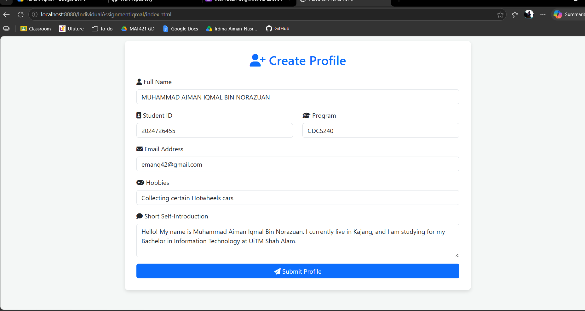
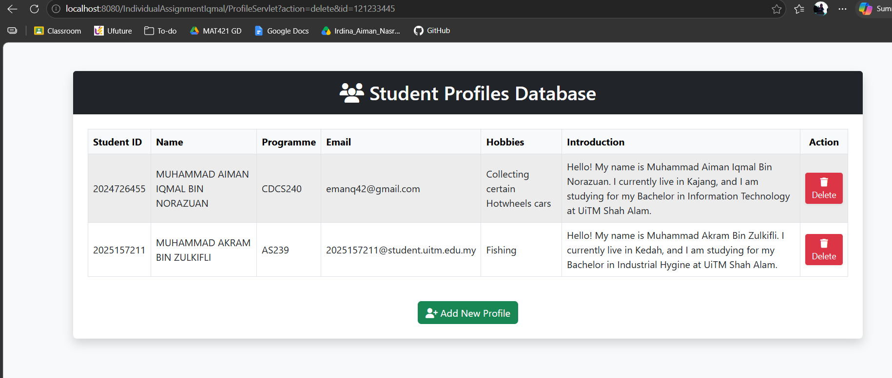

# Student Profile Management System

## Project Description

This is an enhanced web-based Profile Management System developed for the **Individual Assignment 2 CSC584**. The application upgrades the previous profile app into a full **MVC (Model-View-Controller)** architecture, integrating a **MySQL database** via **JDBC** for secure data storage and management.

## Student Information

* **Name:** MUHAMMAD AIMAN IQMAL BIN NORAZUAN

* **Student ID:** 2024726455

* **Programme:** CDCS240

## List of Implemented Features

* [cite_start]**Profile Creation:** Users can input personal details via a form, which are processed by a Servlet and saved to the database.

* [cite_start]**MVC Architecture:** The system effectively separates data (Model: ProfileBean), logic (Controller: ProfileServlet), and display (View: profile.jsp, viewProfiles.jsp).

* [cite_start]**Database Integration:** Utilizes JDBC to establish connections, insert, and retrieve records from the StudentProfilesDB.

* [cite_start]**View All Profiles:** Displays all student records in a responsive, organized table using Bootstrap styling.

* [cite_start]**Delete Profile:** Implemented the "Delete Profile" feature (Option C) to allow users to remove specific records directly from the database.

## Screenshots of the System

*(Note: Please replace the placeholders below with the actual screenshots of your running application)*

* **Create Profile Form (`index.html`):**

  

* **View Profiles Table (`viewProfiles.jsp`):**

  

## How to Run the Project

1. [cite_start]**Database:** Import the provided `database.sql` script into your MySQL environment to create the `StudentProfilesDB` and `Profile` table.

2. [cite_start]**Setup:** Ensure you have added the `mysql-connector-j.jar` file to your NetBeans project Libraries.

3. [cite_start]**Run:** Right-click your project, select **Clean and Build**, then right-click `index.html` and select **Run File**.